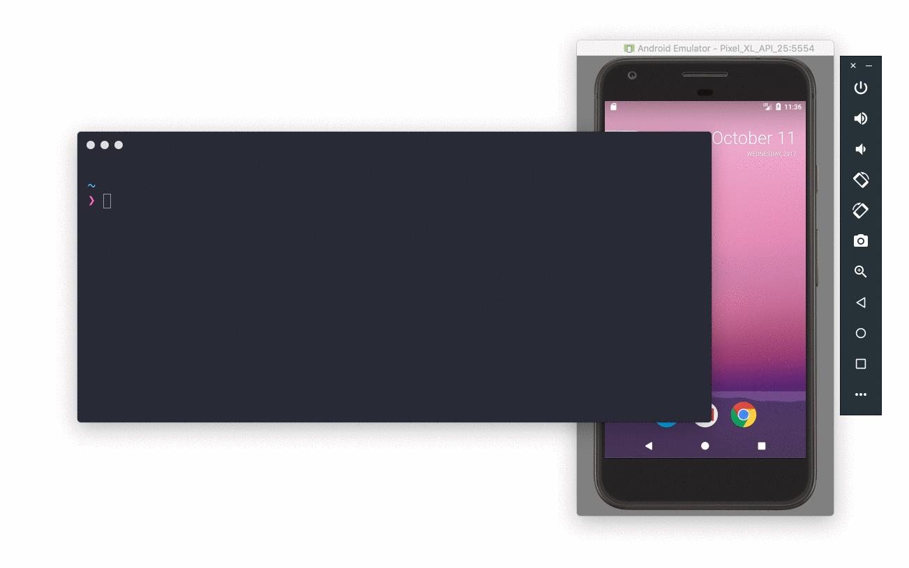

<p align="center">
  <a href="https://github.com/cesarferreira/dryrun" target="_blank">
    
  </a>
</p>
<h1 align="center">dryrun</h1>
<p align="center"><strong>Try any android library</strong> hosted online <strong>directly</strong> from the <strong>command line</strong></p>
<p align="center">
  <a href="https://github.com/cesarferreira/dryrun"></a>
  <a href="https://github.com/cesarferreira/dryrun"></a>
  <a href="https://travis-ci.org/cesarferreira/dryrun"></a>
  <!-- <a href="http://android-arsenal.com/details/1/2361"></a> -->
  <a href="http://androidweekly.net/issues/issue-200"></a>
  <a href="https://www.codacy.com/app/cesarferreira/dryrun?utm_source=github.com&utm_medium=referral&utm_content=cesarferreira/dryrun&utm_campaign=badger"></a>
  
  <!-- <a href="https://github.com/cesarferreira/dryrun/issues"></a>
  <a href="https://github.com/cesarferreira/dryrun/blob/master/LICENSE"></a> -->
</p>

<p align="center">
  
</p>

## Install

```sh
gem install dryrun
```

## Usage

```bash
dryrun https://github.com/cesarferreira/android-helloworld
```

Wait a few seconds and the app is now opened on your phone :smiley:

```bash
$ dryrun -h
Usage: dryrun GIT_URL [OPTIONS]

Options
    -m, --module MODULE_NAME         Custom module to run
    -b, --branch BRANCH_NAME         Checkout custom branch to run
    -f, --flavour FLAVOUR            Custom flavour (e.g. dev, qa, prod)
    -p, --path PATH                  Custom path to android project
    -t, --tag TAG                    Checkout tag/commit hash to clone (e.g. "v0.4.5", "6f7dd4b")
    -c, --cleanup                    Clean the temporary folder before cloning the project
    -w, --wipe                       Wipe the temporary dryrun folder
    -h, --help                       Displays help
    -v, --version                    Displays the version
    -a, --android-test               Execute android tests
```

## Alternative scenario (if you don't use `dryrun`)

1. Find the github's repository url
2. Click the `download zip`
3. Extract the `zip file`
4. Open Android Studio
5. Import the project you just downloaded
6. Sync gradle
7. Run the project
8. Choose the device you want to run
9. Test all you want
10. Delete the `project folder` and the `zip file` when you don't want it anymore

## Goodies

- Private repos can be tested too :smiley:
```
  $ dryrun git@github.com:cesarferreira/android-helloworld.git
```
- No need to cleanup after you test the library.
- No need to wait for **Android Studio** to load.


## Notes

Be aware that ANDROID_HOME needs to be set with the adb path:
 - MAC -> ```ANDROID_HOME=/usr/local/opt/android-sdk```
 - Linux -> ```ANDROID_HOME=/usr/local/opt/android-sdk```
 - Windows -> ```ANDROID_HOME="...sdk"```
In windows this ANDROID_HOME is not automatically created, see more in [here](https://github.com/facebook/react-native/blob/0.24-stable/docs/DevelopmentSetupAndroid.md#define-the-android_home-environment-variable)

Additionally, on windows in order to use git commands, the following path should be on the environment variable
  - ```...\Git\cmd ```

## Created by
[Cesar Ferreira](https://cesarferreira.com)

## License
MIT © [Cesar Ferreira](http://cesarferreira.com)
