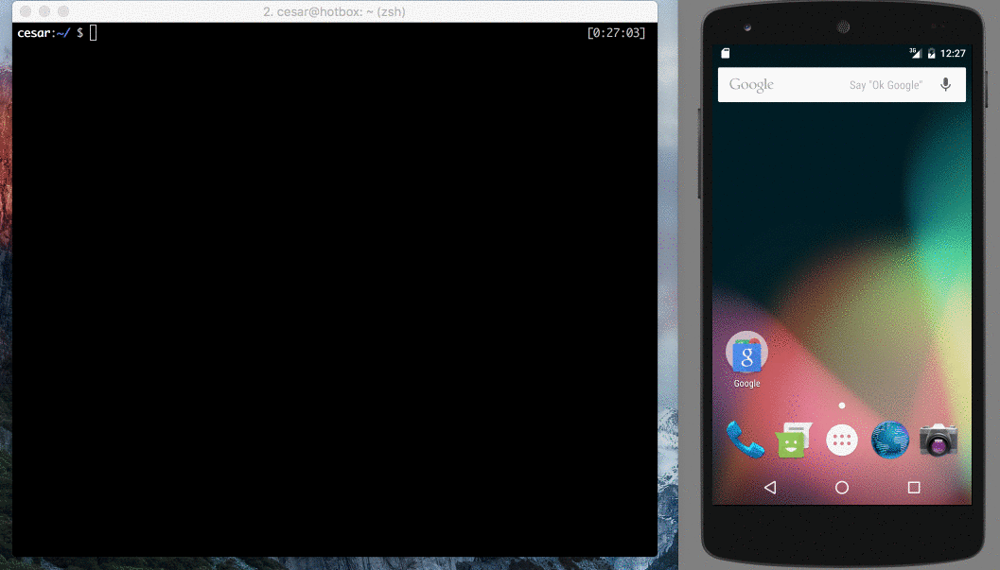

[](https://travis-ci.org/cesarferreira/dryrun)
[](http://badge.fury.io/rb/dryrun)
[](http://android-arsenal.com/details/1/2361)
[](http://androidweekly.net/issues/issue-200)


**Try** any **android library** hosted online **directly** from the **command line**


### Show some :heart:
[](https://github.com/cesarferreira/dryrun)
[](https://github.com/cesarferreira/dryrun/fork) [](https://github.com/cesarferreira/dryrun) [](https://github.com/cesarferreira/dryrun)
[](https://twitter.com/cesarmcferreira)


## Usage
```bash
dryrun https://github.com/cesarferreira/android-helloworld
```
<p align="center">

</p>

Wait a few seconds and the app is now opened on your phone :smiley:

### Advanced usage
```bash
$ dryrun -h
Usage: dryrun GIT_URL [OPTIONS]

Options
    -m, --module MODULE_NAME         Custom module to run
    -b, --branch BRANCH_NAME         Checkout custom branch to run
    -f, --flavour FLAVOUR            Custom flavour (e.g. dev, qa, prod)
    -p, --path PATH                  Custom path to android project
    -t, --tag TAG                    Checkout tag/commit hash to clone (e.g. "v0.4.5", "6f7dd4b")
    -c, --cleanup                    Clean the temporary folder before cloning the project
    -w, --wipe                       Wipe the temporary dryrun folder
    -h, --help                       Displays help
    -v, --version                    Displays the version
    -k, --keystore KEYSTORE          Custom keystore path
    --build_type BUILD_TYPE      Custom buildType (e.g. srv1, srv2)
```

## Installation

    $ gem install dryrun

## Goodies

- Private repos can be tested too :smiley:
```
  $ dryrun git@github.com:cesarferreira/android-helloworld.git
```

- No need to cleanup after you test the library.

- No need to wait for **Android Studio** to load.


## Notes

Behaware that ANDROID_HOME needs to be set with the adb path:
 - MAC -> ```ANDROID_HOME=/usr/local/opt/android-sdk```
 - Linux -> ```ANDROID_HOME=/usr/local/opt/android-sdk```
 - Windows -> ```ANDROID_HOME="...sdk"```
In windows this ANDROID_HOME is not automatically created, see more in [here](https://facebook.github.io/react-native/releases/0.21/docs/android-setup.html#define-the-android-home-environment-variable)

Additionally, on windows in order to use git commands, the following path should be on the environment variable
  - ```...\Git\cmd ```

## Alternative scenario (if you don't use `dryrun`)

1. Find the github's repository url
2. Click the `download zip`
3. Extract the `zip file`
4. Open Android Studio
5. Import the project you just downloaded
6. Sync gradle
7. Run the project
8. Choose the device you want to run
9. Test all you want
10. Delete the `project folder` and the `zip file` when you don't want it anymore

## Contributing
I welcome and encourage all pull requests. It usually will take me within 24-48 hours to respond to any issue or request. Here are some basic rules to follow to ensure timely addition of your request:
  1. Match coding style (braces, spacing, etc.) This is best achieved using `CMD`+`Option`+`L` (Reformat code) on Mac (not sure for Windows) with Android Studio defaults.
  2. If its a feature, bugfix, or anything please only change code to what you specify.
  3. Please keep PR titles easy to read and descriptive of changes, this will make them easier to merge :)
  4. Pull requests _must_ be made against `develop` branch. Any other branch (unless specified by the maintainers) will get rejected.
  5. Check for existing [issues](https://github.com/cesarferreira/dryrun/issues) first, before filing an issue.
  6. Have fun!

### Created & Maintained By
[Cesar Ferreira](https://github.com/cesarferreira) ([@cesarmcferreira](https://www.twitter.com/cesarmcferreira))
